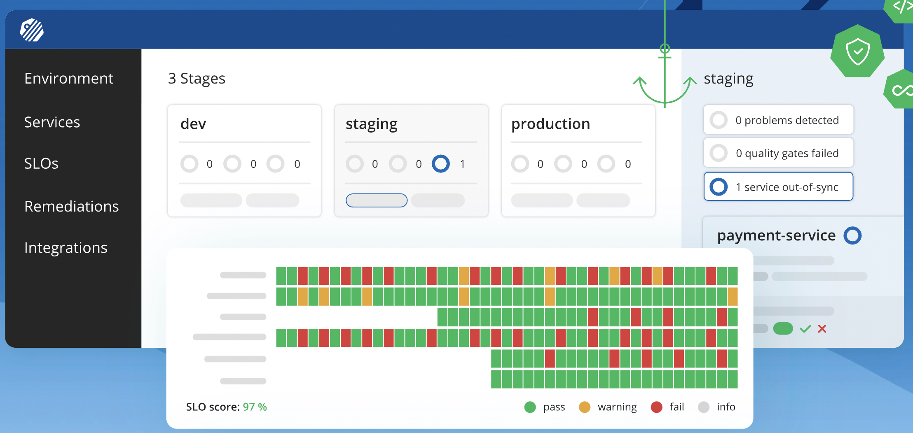

# kubeops-part-time - Question

## Table of content
- [kubeops-part-time - Question](#kubeops-part-time---question)
  - [Table of content](#table-of-content)
  - [Normal](#normal)
  - [Intermediate](#intermediate)
  - [Professional](#professional)
  - [Hands-On](#hands-on)
  - [Algorithms](#algorithms)

---

## Normal 
> [back to table content](#table-of-content)

1. Describe Git branching strategies (Git-flow, single branch, feature branch etc.) which you have used and what purpose does it serves.

> ANS: ใช้ git-flow เป็นการแบ่ง branch เพื่อใช้ประโยชน์ รวมถึงแยกโค้ดที่ทดสอบแล้ว หรือกำลังพัฒนาออกจากกัน
>
> - **master** เป็น branch ของโค้ดที่เสร็จแล้ว ทดสอบเรียบร้อยแล้ว หรือเรียกว่า production รวมถึงจะติด tag version เพื่อแยก version ใหม่เก่าออกจากกัน และให้ง่ายต่อการ deploy หรือ rollback
> - **develop** เป็น branch หลักของโปรเจค เพราะหากมี feature ใหม่ๆ จะต้อง merge มารวมกันที่นี่ก่อน รวมถึงเพื่อใช้ทดสอบก่อนจริงก่อนขึ้น production อีกทั้ง develop จะแตก branch มาจาก master เพื่อที่จะได้ pull request กลับเข้า master เมื่อพร้อมจะ deploy production
> - **feature** เป็น branch ย่อยที่แตกจาก develop เพื่อพัฒนา หรือแก้ไขฟังก์ชันต่างๆ ที่ต้องแยกเพื่อให้คนในทีม สามารถพัฒนาไปพร้อมๆ กันได้ และเมื่อเสร็จจะ merge กลับเข้า develop
> - **hotfix** เป็น branch ย่อยที่แตกมาจาก master เพื่อแก้ไข bug ที่อาจเกิดขึ้นได้ หากเร่งด่วนจะ merge กลับเข้า master แต่ถ้าไม่ด่วนมาก จะ merge เข้า develop เพื่อรอทดสอบต่อไป

2. How do you revert a commit that has already been pushed and made public?

> ANS: สามารถใช้คำสั่ง `git reset` หรือ `git revert` โดยทั้งสองตัวมีข้อแตกต่างกันคือ
>
> - **git reset** จะทำการ reset history หรือลบ commit นั้น ๆ หากเลือก mode hard ซึ่งต้องมั่นใจว่าที่ reset นั้นถูกต้อง เพราะหาก git force push แล้วคนอื่น pull ลงมาจะย้อนกลับไม่่ได้
> - **git revert** จะทำการยกเลิกการแก้ไขของ commit นั้น โดยจะ commit ใหม่ต่ออีกที แนะนำวิธีนี้เพราะปลอดภัย เพราะจะยังคงมี history เหลืออยู่

3. How do you normally solve conflicts in a feature branch before merge?

> ANS: ใช้คำสั่ง **git rebase** ก่อนเพื่อป้องกันการ conflict โดยเมื่อใช้ git rebase จะเป็นการนำ history ของเส้นที่จะ rebase มาเป็นฐานของ branch ปัจจุบัน เมื่อเกิด conflict ก็จะสามารถแกัไขได้ ก่อน pull request หรือ merge ในอนาคต

4. “200 OK” what does it mean and show use case this HTTP Status?

> ANS: เป็น http status ที่ใช้สื่อสารกับ client ว่าการทำงานนั้นเสร็จสมบูรณ์แล้ว เช่น เปิดหน้าเว็บไชต์ถ้าเปิดได้ปกติ ก็จะได้ 200 OK รวมถึงการดาวน์โหลดไฟล์ต่าง ๆ ที่ใช้ในเว็บนั้น ๆ
>
> - อีกทั้งยังใช้ในการตรวจสอบการติดต่อระหว่าง server สองตัว ว่าปกติดีหรือไม่

5. “201 Created” what does it mean and show use case this HTTP Status?

> ANS: เป็น status ที่ใช้ในการแจ้ง client ว่าการสร้างนั้นๆ เสร็จเรียบร้อยดี เช่น การเพิ่มรายการสินค้า ทั้งนี้อาจจะต้องตกลงในทีมให้เรียบร้อย เพราะบางคนจะตีความใช้ 200 บางคน 201 ดังนั้น ต้องชัดเจน

6. “301 Moved Permanently” what does it mean and show use case this HTTP Status?

> ANS: เป็น status ที่บอก client ว่ามีการ redirect url นึงไปอีกที่ เช่น เข้า url ผ่าน A แต่มีการ redirect ต่อไปยัง B

7. “400 Bad Request” what does it mean and how to identify the problem?

> ANS: เป็น status บอก client ว่าการส่ง request มีปัญหา เช่น การข้อมูลที่ส่งไปยัง server นั้นมีข้อมูลไม่ถูกต้อง อาจเพราะใช้ email ซ้ำ หรือ รูปแบบวันที่ผิดจากที่ server นั้นต้องการ
> ควรจะต้องแจ้ง user ที่กำลังใช้งานว่า ผิดที่ข้อมูลส่วนไหน เช่น เบอร์โทร ไม่ครบ 10 ตัว

8. “401 Unauthorized” what does it mean and how to identify the problem?

> ANS: เป็น status บอก client ว่าไม่ได้ยืนยันตัวตน ทำให้เข้าถึงไม่ได้ ดังนั้นมักจะ redirect ให้ login ก่อน
>
> - การระบุปัญหา จะต้องตรวจดูว่า server มีการ auth อย่างไร มีการใช้ token หรือ cookie หรือไม่ ถ้าใช้ ดูว่ามีครบ หรือส่งไปกับ header หรือไม่

9. “403 Forbidden” what does it mean and how to identify the problem?

> ANS: เป็น status บอก client ว่าไม่มีสิทธิ์ในการเข้าถึง เช่น user ไม่มีสิทธิ์ในหน้า admin หรือระดับสิทธิ์ไม่ถึงตามที่ server กำหนด
>
> - การระบุปัญหา จะต้องตรวจสอบว่า user ที่ใช้งานมีสิทธิ์ หรือระดับ user กับ api นั้น ๆ หรือไม่

10. “404 Not Found” what does it mean and how to identify the problem?

> ANS: เป็น status บอก client ว่าหน้าที่กำลังเข้าถึงนั้นไม่มีอยู่ หรือไม่พบ รวมถึง server แจ้งว่าไม่พบ เช่น user id หรือ product id ที่เรียกอยู่
>
> - การระบุปัญหา จะต้องลองค้นหาไฟล์ที่อยู่บน server ว่ามีอยู่จริงหรือไม่ หรือชื่อเปลี่ยนไป path ถึงต้องไหม

11. “500 Internal Server Error” what does it mean and how to identify the problem?

> ANS: เป็น status ที่แจ้ง client ว่ามีปัญหาบางอย่างที่ server ทำให้ไม่สามารถให้บริการได้ อาจจะเกิดจากการล่มของฐานข้อมูล ทำให้ server ไม่สามารถตอบสนอง client ได้
>
> - การระบุปัญหา จะต้องดูจาก log ที่มีการเก็บไว้ ว่าเกิดที่ service ใดๆ ช่วงเวลาไหน เพื่อที่จะได้แก้ไขได้ถูกต้อง

12. “502 Bad Gateway” what does it mean and how to identify the problem?

> ANS: เป็น status ที่แจ้ง client ว่ามีปัญหาจากการติดต่อ server เช่น proxy ก่อนเข้าถึง backend มีปัญหา
>
> - การระบุปัญหา ดู log ประกอบ รวมถึง check status ของ proxy หรือบริการที่อาจจะมีปัญหา ว่ายังทำงานได้ครบถ้วน หรือไม่

13. “503 Service Unavailable” what does it mean and how to identify the problem?

> ANS: เป็น status ที่แจ้ง client ว่ามี service มีปัญหา เช่น อาจจะรับ request ไม่ไหว ดังนั้น หากมี 503 เกิดขึ้นแสดงว่า อาจจะต้องดูว่า service หรือเครื่อง server เรามี spec ที่เพียงพอแล้วหรือยัง หรือน้อยเกินไป ในการให้บริการ
>
> - การระบุปัญหา ดู log ประกอบ รวมถึงดูว่าช่วงเวลาที่มีปัญหา สัมพันธ์กันอย่างไรกับปริมาณ request อาจจะลองเพิ่ม spec หรือ container แล้วลองยิ่ง request เพื่อทดสอบการรองรับ ว่าเพียงพอ หรือเผื่อไว้มากพอ

14. “504 Gateway Timeout” what does it mean and how to identify the problem?

> ANS: เป็น status ที่แจ้งว่า service มีปัญหา เพราะเนื่องจาก ระยะเวลาที่ใช้ทำการนานไป และอาจส่งผลต่อ user คนอื่น จึงต้องตัด connection ที่รอนาน เพื่อลดปัญหาทั้งระบบ
>
> - การระบุปัญหา จะต้องทดสอบการยิง request จาก vpn หลายๆ ที่ เพื่อทดสอบว่า กลุ่มลูกค้าที่ใช้ มีปัญหามากน้อย แค่ไหน อาจต้องเพิ่ม sever, cdn ที่ประเทศนั้นๆ

15. What are Linux network tools do you use for troubleshooting network problems as well as usage scenarios for each tool?

> ANS:
>
> - **ping** เป็น tool ในการทดสอบการติดต่อระหว่าง server ว่าสามารถติดต่อได้หรือไม่ มักจะเป็น tools ตัวแรกในการตรวจสอบปัญหา รวมถึงดูระยะเวลาการตอบสนอง ว่านานเกินไปหรือไม่
> - ตัวที่สอง หาทดสอบเชื่อมต่อด้วย ping แล้ว ยังปกติ ต้องหาว่า service นั้นๆ ทำงานอยู่หรือไม่ โดยใช้ **netstat** ใช้ในการแสดง port ต่างๆ ที่ถูกใช้ในเครื่อง สุดท้ายตรวจสอบว่า domain ที่ผูกไปยิงไป ip ถูกต้องไหม
> - **nslookup** ใช้ในการหา ip ที่ผูกกับ domain name เพื่อให้รู้ว่า domain name นั้นผูกกับ ip ถูกต้องหรือไม่

---

## Intermediate
> [back to table content](#table-of-content)

1. Assume we have an application that is designed as below. Our application stopped responding due to an extremely high number of clients in some circumstances.
We have tried scaling a number of API Gateway and Service A nodes but it didn’t help. What are the possible problems that lies in our system in which components and how to fix them?

> ANS:
>
> - ต้องตรวจดูว่าการทำงานของโค้ดของระบบนั้น ๆ สามารถทำงานแบบ pararell หรือหลาย thread ได้จริงไหม เพราะต่อให้มีจำนวน nodes เพิ่มขึ้น แต่โค้ดไม่มีการกระจายการทำงานจริงๆ ก็อาจจะทำให้ไม่เกิดประสิทธิภาพ
> - อีกปัญหาที่อาจเกิดขึ้นคือการตั้งค่า API Gateway ที่กระจาย load ให้ nodes กระจุกตัว หรือไม่มี load เข้า nodes อื่น ๆ อาจจะต้องทำการดู log ว่าประมาณ request ที่ส่งไปแต่ละ nodes มีปริมาณคล้ายๆ กันหรือไม่ หรือกระจุกตัวแค่ไม่กี่ nodes
> - ตรวจสอบการกิน cpu, ram, disk ว่าแต่ละ service ได้ใช้ประสิทธิภาพส่วนไหนมากที่สุด เพื่อประเมินว่าอาจจะต้องเพิ่มเครื่องหรือไม่ หากยังแก้ปัญหาด้วย 2 วิธีข้างต้นไม่ได้

2. How do you keep the docker image smallest as possible?

> ANS: การใช้ docker muti stage
>
> 1. แยกการ build โดยใช้ image ที่มี env พร้อมในการ build app ให้สมบูรณ์ อาจจะแยกรูปภาพ, วิดีโอ ไปไว้กับ file service เช่น cloudinary, cloud storage เพื่อลดการนำไฟล์ไปกับ image ให้น้อยที่สุด อีกทั้งยังทำให้ build เร็วขึ้น
> 2. นำ build app ที่พร้อมทำงาน มาใส่อีก image ที่มีเฉพาะตัว run time (ตัดส่วนที่ไม่จำเป็นออก เพื่อรีดขนาดตัว image เล็กลง)

3. What is the difference between overlay, bridge, host network in Docker? When to use each of them?

> ANS:
>
> - **overlay** เป็น network สำหรับสื่อสารข้าม server เพราะใน production จะมี server หลายตัวที่ทำงานร่วมกัน หรือแม้กระทั้งเชื่อมต่อกันข้ามโลก ซึ่งจะใช้ใน production เช่น บน docker swarm, k8s ซึ่งการทำงานจะมีการจำลอง network เป็นของตัวเอง ซึ่งทำงานบนระบบ network จริงๆ อีกที
> - **bridge** เป็น network พื้นฐานที่ docker container ใช้สื่อสารกันและกัน โดยใช้ ip ในการติดต่อกัน ซึ่ง docker จะทำการ assign ip ให้แต่ละ container เอง โดย network แบบนี้จะใช้ในตอนที่ dev บนเครื่องตัวเอง ไม่เหมาะกับการใช้งานบน production
> - **host** เป็น network ที่จะใช้ ip ของ server แทนที่จะเป็น ip local โดยจะติดต่อกันและกันผ่าน port วิธีนี้ทำให้การติดต่อกันของ container เร็วกว่าแบบ bridge เพราะไม่ต้อง route ให้เสียเวลา ดังนั้น network แบบนี้ไม่เหมาะกับ production มากนักเพราะ port จะ public ตาม ip ด้วย ทำให้ความปลอดภัยน้อยลง หากมีการ scan port เพื่อโจมตี

4. How does the Kubernetes service talk to each other in the same cluster?

> ANS:
> - k8s service คุยกันด้วย domain name ซึ่ง k8s จะ generate ตามการตั้งค่า service รวมถึง port เช่น service ใช้ hi.svc.default:3000 คุยกับ world.svc.default:3000
> - k8s รวบรวมไว้เป็น DNS กลางทำให้ service ใน cluster รู้จักกันและกัน

5. What’s different between L2, L4, and L7 Load balancers? When to use it?

> ANS:
>
> - L2 เป็นการใช้ link lan ระหว่าง hardware หลายตัว เพื่อรวม bandwidth ให้มากขึ้น level นี้ต่างกับอื่น ๆ คือไม่ได้เกี่ยวข้อง software มากนัก
>   - - ใช้เมื่อ Level อื่น ๆ เพิ่มเต็มที่แล้ว ทำให้ต้องพิจารณาเพิ่ม hardware
> - L4 เป็นการให้ server หลายตัว มีการ deploy instane มากกว่า 1 ตัวทำให้มีตัวสำรอง หากตัวนึงตายก็ยังมี instance สำรองอยู่นั่นเอง และเมื่อมี request ยิงเข้ามาจะทำการ round robin หรือเทคนิคอื่น ๆ เพื่อวนเรียก server แต่ละตัวที่มีระบบแบบเดียวกันให้บริการ ซึ่งยากต่อการ scale เพราะถึงจุดๆ นึงการ scale จะไม่มีผล เนื่องจาก service ที่ผูกกันมากเกินไป สิ่งนี้ทำให้ต่างกับ L7 ที่จะแยก service ที่หน้าที่แตกต่างกันออกจากกัน
>   - - ใช้เมื่อระบบนั้น ๆ เหมืนกัน เช่น database ซึ่งสามารถทำเป็น database cluster ได้
> - L7 เป็นการแบ่งภาระหน้าที่ต่างกัน เพื่อกระจายการทำงาน คนละหน้าที่ เช่น server 1 ให้บริการไฟล์ server 2 ให้บริการฐานข้อมูล ดังนั้นการใช้ micro service จึงมีประโยชน์มาก เมื่อ service แต่ละตัวแยกออกจากกัน หาวัดประมาณการใช้งาน ก็จะสามารถควบคุม nodes หรือจำนวน container ได้ว่าควรเพิ่มขึ้นหรือลดลง ส่งผลให้การจูนประสิทธิภาพมากขึ้น เพราะ service บางตัวต้องการ nodes หรือ spec ram, cpu มากกว่าตัวอื่น ทำให้การ scaling สามารถทำได้โดยง่าย ทำให้ k8s จึงมาช่วยได้ในเรื่องนี้
>   - - ใช้เมื่อ ระบบของเรามีความซับซ้อน มีขนาดใหญ่ มี service ย่อย ๆ ทำงานร่วมกันจำนวนมาก รวมถึงต้องการจัดสรรให้ สามารถ scaling บาง service ได้

---

## Professional
> [back to table content](#table-of-content)

1. Assume that you are using a private cloud for your infrastructure. How do you manage logs, metrics, and alerts for your infrastructure and applications? Which tools do you use and why?

> ANS:
> - ใช้ **Loki** ใช้สำหรับการรวบรวม log จาก application รวมถึง infra ต่างๆ เพื่อนำไปประมวณผลแสดงผลต่อที่ dashboard 
> - ใช้ **grafana** เป็น dashboard เพราะรองรับ plugin ได้หลากหลาย อีกทั้งเชื่อมต่อ software ได้หลายตัว ทำให้ง่ายต่อการดู log หรือ metrics 
> - สาเหตุที่เลือก loki กับ grafana เพราะเป็น software เจ้าเดียวกัน ทำให้เวลาเกิดปัญหา สามารถซือ support เดียวกันได้ง่าย รวมถึงความเข้ากันได้ของ software สองตัวด้วย
> - ส่วนการแจ้งเตือน ก็เรียก webhook ส่งไปยัง slack หรือ line เมื่อถึงเงื่อนไขที่กำหนด เช่น มีการใช้ CPU มากกว่าปกติ, ไม่สามารถเชื่อมต่อ database

2. How do you secure the following?
   - application
   - infrastructure
   - data

> ANS:
> - การเข้าถึง dashboard จะต้องกำหนดสิทธิ์ หรือบัญชีผู้ใช้ ไม่ใช้ username, password default รวมถึงหากมีการเชื่อมต่อกับ software, plugin ภายนอก ควรจะตรวจสอบอยู่เสมอ รวมถึงจำกัดสิทธิ์ไม่ให้มากเกินไป 
> - ข้อมูล log เองไม่ควรเก็บข้อมูลที่ sensitive ของ user เพราะอาจจะหลุดสู่ภายนอก ส่งผลเสียต่อระบบได้
> - ส่วนข้อมูลที่รวบรวม จะต้องมีการเข้ารหัส เพื่อป้องกัน หากมีการหลุดสู่โลก internet
> - การแจ้งเตือนก็สำคัญ เพราะยิ่งรู้เร็วยิ่งแก้ปัญหาได้รวดเร็ว ดังนั้นควรตรวจสอบเสมอว่าระบบแจ้งเตือนทำงานได้ถูกต้อง และควรมีหลายช่องทางในการแจ้งเตือน เช่น slack, line เผื่อกรณีตัวใดตัวนึงไม่สามารถทำงานได้

3. Base on your experience, how do you reduce your service downtime as much as possible during
   - software upgrade
   - database migration
   - incident

> ANS:
>
> - การมี server ทำเป็น cluster ทำให้หากมีปัญหาก็สามารถ route ไปยัง node ที่ปกติได้ หากมีการทำ db migrate, software upgrade ควรจะทะยอยทำทีละ nodes รวมถึงใช้ cache ที่ server สำรองจากนั้นค่อยตั้ง job เพื่อให้ทะยอย update กลับไปที่ server หลัก
> - หากเกิด incident จะต้องสามารถ rollback กลับไป version เดิมได้อัตโนมัติ

4. Configuration management
  a. Which Among Puppet, chef, Ansible, or another is the best Configuration management tool?
  b. Why?
  c. Do you still need to use it if you already have docker-swarm or Kubernetes?

> ANS:
> - a. terraform
> - b. เพราะช่วยสามารถจัดการ การสร้าง vm หรือ deploy nodes ไปยัง cloud ผู้ให้บริการได้ แถมอยู่ในรูปแบบ code ทำให้จัดการ หรือ rollback ได้ อีกทั้งมี doc ที่เข้าใจง่าย อีกทั้งสามารถเขียนเงื่อนไข if else
> - c. ใช้ร่วมกับการสร้าง k8s cluster โดยกำหนด nodes รวมถึง spec เพื่อเพิ่ม nodes ใหม่ หรือลบ nodes ลงผ่าน code ที่ config ใว้ ทำไมต้องใช้ร่วมกัน เพราะ k8s เองให้จัดการ software deployment ไป ส่วนระดับ config infra ให้ terraform จัดการ เพราะแต่ละ tools เองมีจุดเด่น หรือความสามารถเฉพาะทางที่ต่างกัน ดังนั้นจึงเลือกใช้ตัวที่คิดว่าเหมาะสมกับงานมากกว่าตัวเดียวจบ

5. How do you design your Kubernetes cluster? what DNS, CNI, ingression is being used? Why?

> ANS: การออกแบบจะดูว่า software ที่จะต้อง deploy มี service อะไรบ้าง รวมถึงการแยก beta, alpha, dev, prod enviroment ให้ชัดเจน เพื่อเหมาะสำหรับทดสอบ หรือพัฒนาในทีม โดยการแยก namespace สำหรับ project นั้น ๆ ทำให้ติดตาม หรือ debug ได้ง่ายกว่าการกระจุก namespace เดียว
>
> - DNS มีการใช้เพื่อระบุ ip ของ service เพราะ k8s ใช้ domain name ในการติดต่อกันระหว่าง service ดังนั้นจึงต้องมีระบบ DNS เพื่อชี้ ip ให้ถูกต้อง
> - CNI เป็นมาตรฐานในการติดต่อระหว่าง container เพื่อใช้ในการจัดการ resorce ใน cluster ให้มีประสิทธิภาพ โดยสามารถเปลี่ยน CNI อื่น ๆ ได้ตามความเหมาะสม
> - ingression เป็นตัวที่จัดการการวิธีเชื่อมต่อระหว่างภายนอก เข้ามา k8s cluster เช่น การกำหนด port หรือ domain name กับ service

6. How do you measure service quality to give the best experience to your customer? (SLO, SLA)

> ANS: ใช้ software ในการบันทึกสถิติการทำงานของ service หรือ nodes ใดๆ ทั้งจำนวนปกติ จำนวนครั้งที่พัง หรือล่ม โดยเลือกใช้ Keptn เป็นตัวช่วยการ check รวบรวม health ของ service อีกทั้งยังสามารถวัดออกมาเป็น percent SLO ได้ อีกทั้งสามารถตั้งให้แจ้งเตือน ไปยังช่องทางต่างๆ เช่น slack, line, email
> - ดังภาพตัวอย่าง
> 

---

## Hands-On
> [back to table content](#table-of-content)

1. Please build and deploy your application of choice using Kubernetes. It should support multiple environments (e.g. beta, prod).
The solution must include the following

- Architecture Diagram
- Dockerfile or Buildpacks supports the following languages:
  - .Net Core
  - Go
  - Java
  - Node
  - Rust

- CI/CD pipeline file:
  You can choose your CI/CD tool:
  - Gitlab CI
  - Github Actions
  - CircleCI
  - Jenkins
  - Travis CI
  - GoCD
  - BitBucket
  - Azure DevOps
- Kubernetes Manifests
- Kubernetes Ingress Configuration

Please update README for steps how to test, build, deploy and run the application using Kubernetes

> ANS:

---

## Algorithms

> [back to table content](#table-of-content)

Choose your favorite language (Rust would be advantages) to solve the following challenges:

1. FizzBuzz...But: You may heard the FizzBuzz task. Here we have the same rule. You will write a function fizzBuzz that receive a single parameter it will return the value base on these rule.

- If the input is divisible by 3, return 'Fizz'
- If the input is divisible by 5, return 'Buzz'
- If the input is divisible by both 3 and 5, return 'FizzBuzz'

BUT we're not allow you to use if/else statement. If there is any if or else word in your code. I will consider this question with 0 scores :(

**Example**

```
> fizzBuzz(21)
Fizz

> fizzBuzz(25)
Buzz

> fizzBuzz(45)
FizzBuzz
```

> ANS: [fizz_buzz.rs](https://github.com/naijab/kubeops-part-time/blob/master/algorithms/src/fizz_buzz.rs)


2. Bob has a server farm crunching numbers. He has nodes servers in his farm. His company has a lot of work to do. The work comes as a number workload which indicates how many jobs there are. Bob wants his servers to get an equal number of jobs each. If that is impossible, he wants the first servers to receive more jobs. He also wants the jobs sorted, so that the first server receives the first jobs. The way this works, Bob wants an array indicating which jobs are going to which servers.
Can you help him distribute all this work as evenly as possible onto his servers?

**Example**

Bob has 2 servers and 4 jobs. The first server should receive job 0 and 1 while the second should receive 2 and 3.

```
distribute(2, 4) # => [[0, 1], [2, 3]]
```

On a different occasion Bob has 3 servers and 3 jobs. Each should get just one.

```
distribute(3, 3) # => [[0], [1], [2]]
```

A couple of days go by and Bob sees a spike in jobs. Now there are 10, but he hasn't got more than 4 servers available. He boots all of them. This time the first and second should get a job more than the third and fourth.

```
distribute(4, 10) # => [[0, 1, 2], [3, 4, 5], [6, 7], [8, 9]]
```

3. It's tricky keeping track of who is owed what when spending money in a group. Write a function to balance the books.

- The function should take one parameter: a dict with two or more name-value pairs which represent the members of the group and the amount spent by each.
- The function should return a dict with the same names, showing how much money the members should pay or receive.

Further points:

- The values should be positive numbers if the person should receive money from the group, negative numbers if they owe money to the group.
- If value is a decimal, round to two decimal places.

**Example**

3 friends go out together: A spends $20, B spends $15, and C spends $10. The function should return an object/dict showing that A should receive $5, B should receive $0, and
C should pay $5.

```
var group = {
    A: 20, 
    B: 15, 
    C: 10
}
 
splitTheBill(group) // returns {A: 5, B: 0, C: -5}

```

1. Fibonacci
The Fibonacci numbers are the numbers in the following integer sequence.

```
0, 1, 1, 2, 3, 5, 8, 13, 21, 34, 55, 89, 144, …
```

In mathematical terms, the sequence Fn of Fibonacci numbers is defined by the recurrence relation

Fn = Fn-1 + Fn-2

with seed values

F0 = 0 and F1 = 1.

Given a number n, print n-th Fibonacci Number.

5. Palindrome
Given a string, write a function to check if it is palindrome or not.

In case: even you can reverse the string

In case: odd you should use the middle to split the word and then reverse the string

A string is said to be palindrome if the reverse of the string is the same as the string. For example, “abba” is Palindrome, but “abbc” is not Palindrome.

Anna, civic, kayak, level, madam, mom, noon, racecar, radar, redder, refer, repaper, rotator, 12321, 15651
