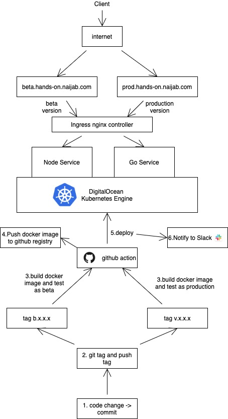

# Hands-on

## Architecture

## URL

### Beta

- [Node Service - https://beta.hands-on.naijab.com/node](https://beta.hands-on.naijab.com/node)
- [Go Service - https://beta.hands-on.naijab.com/go](https://beta.hands-on.naijab.com/go)

### Production

- [Node Service - https://prod.hands-on.naijab.com/node](https://prod.hands-on.naijab.com/node)
- [Go Service - https://prod.hands-on.naijab.com/go](https://prod.hands-on.naijab.com/go)

---
## Requirement

- **make** with `brew install make`

## How to run

- on local, change directory to service folder
- copy **.env.example** to **.env** and update variable values
- `make install` - for installing dependencies
- `make dev` - for running as development mode
- `make start` - for running as production mode
- `make test` - for running unit test
- `make test-docker` - for running unit test on dockerfile
- `make build-docker` - for building docker image

## CI Flow

- if push is only run unit test not deploy
- tag with `b.x.x.x` and push tag will deploy as Beta
- tag with `v.x.x.x` and push tag will deploy as Production

